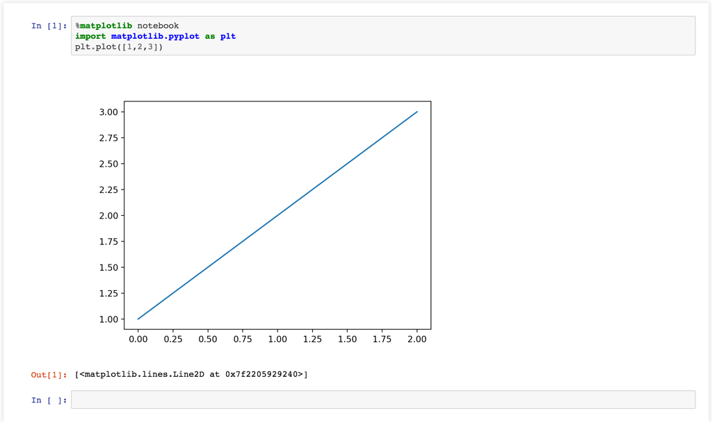

# Docker for Jupyter and Pandas

This is docker image for Python3, Jupyter and Pandas, based on alpine linux

### Build Docker Image

```bash
docker build -t jupyter-23  .
```

### Run

You can run the command below:

```bash
docker run -d --name jupyter -p 8888:8888 -v YOU_VOL_FOLDER:/opt jupyter-23
```

and visit [http://localhost:8888](http://localhost:8888) for jupyter notebook

### Plot

You can use the command in jupyter to plot images

```python
%matplotlib notebook
import matplotlib.pyplot as plt
plt.plot([1,2,3])
```

and you can see the imags below:


